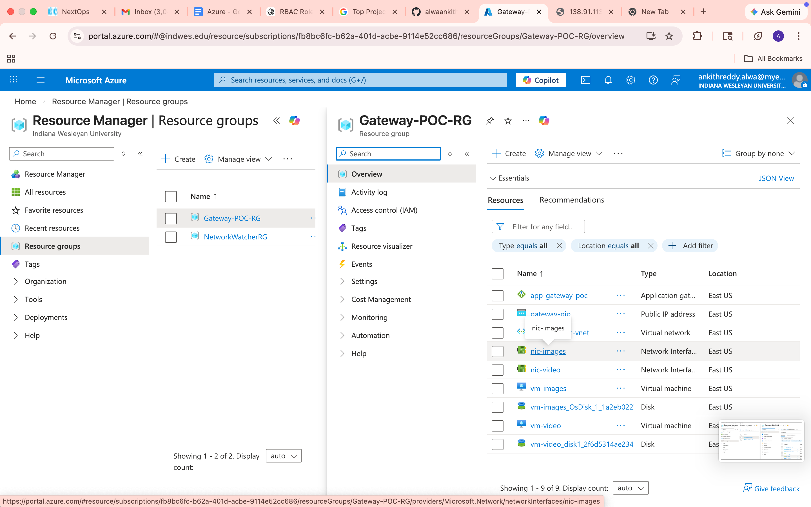
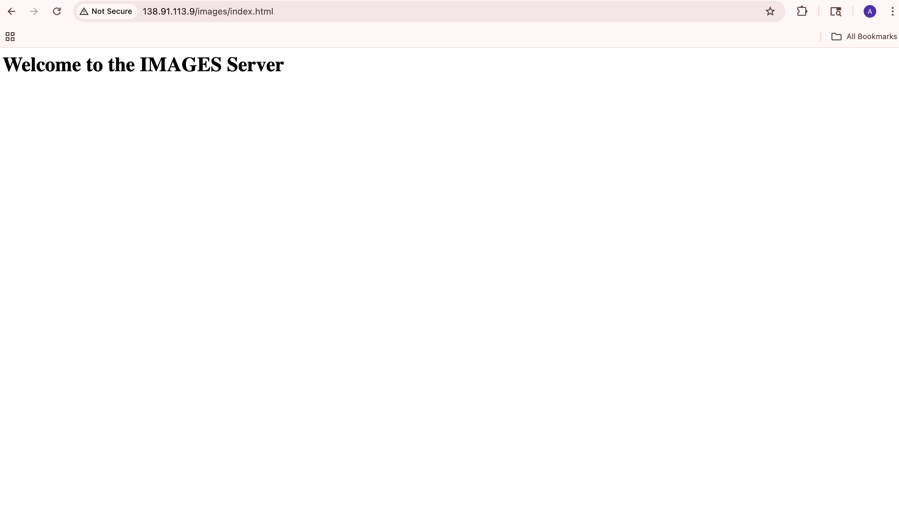
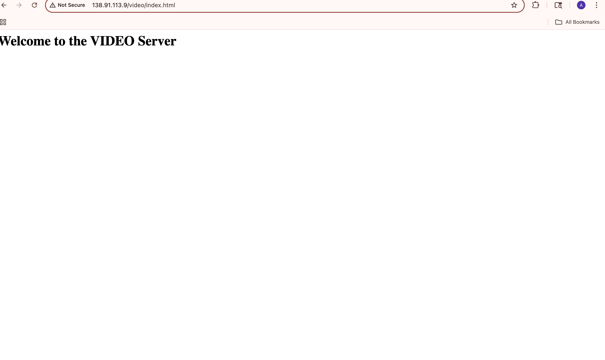

# Azure Application Gateway: Path-Based Routing POC

## 🚀 Project Overview
This project demonstrates an enterprise-grade implementation of **URL Path-Based Routing** using Azure Application Gateway. It was built using an **Agile DevOps workflow** with Infrastructure as Code (Terraform).

## 🛠️ Tech Stack
*   **Cloud:** Microsoft Azure
*   **IaC:** Terraform (HashiCorp)
*   **Version Control:** Git & GitHub
*   **Web Server:** NGINX (Ubuntu 22.04 LTS)

## 📐 Architecture & Logic
The gateway acts as a single entry point (Public IP) and routes traffic to specific backend pools based on the URL path:
*   `http://<Public-IP>/images/*` ➡️ Routed to **vm-images** (Pool A)
*   `http://<Public-IP>/video/*` ➡️ Routed to **vm-video** (Pool B)

## 🔄 Agile Workflow Followed
1.  **Local Setup:** Configured VS Code, Azure CLI, and Terraform via Homebrew.
2.  **Branching Strategy:** Followed a feature-branch workflow (`feature/networking`, `feature/gateway-logic`, `feature/backend-vms`).
3.  **Peer Review Simulation:** Used GitHub Pull Requests (PRs) to merge code into the `main` branch.
4.  **Automated Deployment:** Used `terraform plan` to predict changes and `terraform apply` to provision the 9-resource stack.

## 🧪 Verification
*   Successfully verified **200 OK** responses for both `/images/index.html` and `/video/index.html`.
*   Handled real-world hurdles including **Regional SKU Capacity** limits and **TLS Security Policy** updates.
## 📸 Project Results & Proof of Work

### 1. Azure Resources Provisioned
Below is the screenshot from the Azure Portal showing the full stack (Gateway, VNet, VMs, and NICs) successfully deployed via Terraform.

### 2. Path-Based Routing Verification
The Application Gateway correctly identifies the URL path and routes the traffic to the corresponding backend server.

| Path | Browser Response | Description |
| :--- | :--- | :--- |
| `/images/*` |  | Traffic routed to the Image Backend Pool |
| `/video/*` |  | Traffic routed to the Video Backend Pool |
